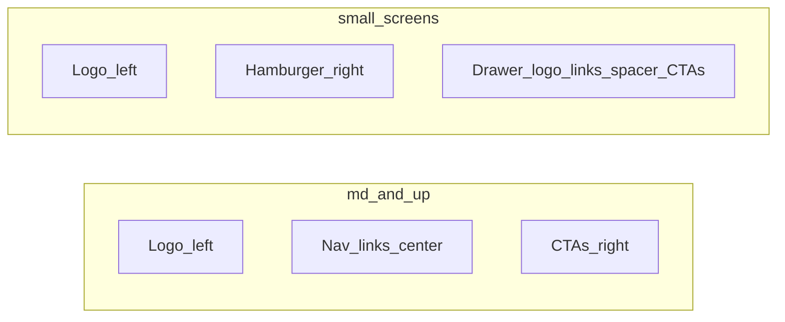
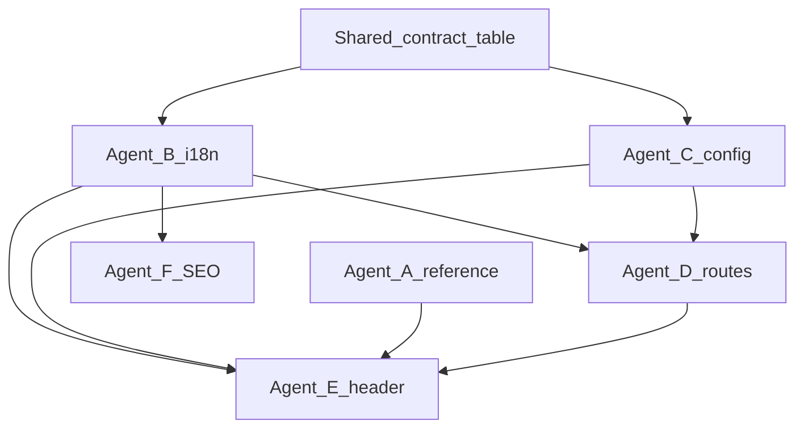

# Plan: PodCodar navbar, i18n, and config

This document is the single source of truth for implementing the marketing-site shell: **navbar** (desktop + mobile drawer), **pt-BR / en** i18n using the [Astro i18n recipe](https://docs.astro.build/en/recipes/i18n/), and a **`src/config/`** layer similar in spirit to Phoenix config.

Execution can be split across **parallel agents** (see [Parallel workstreams](#parallel-workstreams)); merge order follows [Dependencies](#dependencies).

---

## Goals

- **Visual parity:** Match navbar styling from [podcodar.fly.dev](https://podcodar.fly.dev) and from the Elixir app at `~/w/podcodar/podcodar` (local clone; not in this git repo).
- **Structure (desktop):** Logo (left) · navigation links (center) · CTAs (right).
- **Structure (mobile):** Hide center column; replace right column with a **hamburger** that toggles a **drawer** containing: logo (top), navigation links, `flex-1` spacer, CTAs (bottom).
- **Copy:** Portuguese labels as specified; English via i18n. Default locale **pt-BR** with **no locale prefix** in the URL; English under `/en/...` (see recipe section *Hide default language in the URL*).
- **No hardcoded nav strings** in components—use **config** + **`t()`** keys.

---

## Reference styling

| Source | Action |
|--------|--------|
| podcodar.fly.dev | Inspect in browser when available: spacing, navbar height, link styles, DaisyUI/Tailwind classes for buttons and drawer. |
| `~/w/podcodar/podcodar` | Compare HEEx/layout for structure and class names; align tokens with existing `global.css` + daisyUI. |

Deliverable for research track: short **notes file or section** (classes, breakpoints, drawer pattern)—optional `docs/nav-notes.md` if you want it versioned.

---

## Layout behavior

- **Center links (pt-BR):** Home, A Comunidade, Missão, Contato.
- **CTAs:** Secondary — “Como ajudar?” · Primary — “Faça parte!” (exact strings live in `src/i18n/ui.ts`).
- **Accessibility:** `aria-expanded` / `aria-controls` on toggle; label drawer; focus trap optional follow-up.

---

## i18n (Astro recipe)

Follow **manual** i18n from the official recipe (not mandatory `astro.config.i18n` middleware unless you choose to add it later).

- **`src/i18n/ui.ts`:** `languages`, `defaultLang`, `showDefaultLang: false`, `ui` dictionaries (nav, cta, chrome), optional `routes` for translated slugs (`missao` ↔ `mission`).
- **`src/i18n/utils.ts`:** `getLangFromUrl`, `useTranslations`, `useTranslatedPath` per recipe; tune `getLangFromUrl` for URLs where default locale has no prefix.
- **`html lang`:** From `getLangFromUrl(Astro.url)` in a shared layout.
- **Language picker:** Recipe-style links using `translatePath` (footer and/or nav).

Canonical / `hreflang` strategy should be documented in the SEO track.

---

## Configuration (`src/config/`)

Phoenix-inspired: typed modules, no secrets in repo (use `PUBLIC_*` env vars).

| File | Purpose |
|------|---------|
| `navigation.ts` | Stable ids for nav items and CTAs, href path keys, `external` vs internal, CTA `variant: 'primary' \| 'secondary'`. |
| `site.ts` | `site` URL alignment with `astro.config.mjs`, optional feature flags. |

Labels in UI **must not** live here—only ids/paths/variants. Labels come from `t('...')` keys that **match** ids (see contract below).

---

## Shared contract (for parallel agents)

Agree on these **before** coding UI that consumes both i18n and config:

| Id | i18n key prefix | Default path (pt-BR) | English path (under `/en`) |
|----|-----------------|----------------------|----------------------------|
| `home` | `nav.home` | `/` | `/en/` |
| `community` | `nav.community` | `/comunidade` | `/en/community` (or translated slug via `routes`) |
| `mission` | `nav.mission` | `/missao` | `/en/mission` |
| `contact` | `nav.contact` | `/contato` | `/en/contact` |
| `cta_help` | `cta.help` | TBD internal or external URL in config |
| `cta_join` | `cta.join` | TBD internal or external URL in config |

Adjust slugs in `routes` / `navigation.ts` as needed; keep this table updated when ids change.

---

## Files to create or change (summary)

| Area | Files |
|------|--------|
| i18n | `src/i18n/ui.ts`, `src/i18n/utils.ts` |
| config | `src/config/navigation.ts`, `src/config/site.ts` |
| components | `Header.astro` (refactor), optional `NavBar.astro`, `MobileDrawer.astro` / drawer markup, `LanguagePicker.astro`, `Logo.astro` tweaks |
| layouts | Shared layout `lang`; `BaseHead.astro` for alternate/hreflang |
| pages | Stubs: comunidade, missão, contato + `/en/...` mirrors; root `index.astro` behavior per recipe |
| astro | `astro.config.mjs` — `site`; manual i18n may omit `i18n` key |

---

## Verification

- [ ] Desktop: three columns; CTAs use daisyUI `btn btn-secondary` / `btn btn-primary` (or match reference).
- [ ] Mobile: center hidden; hamburger opens drawer; order = logo, links, spacer, CTAs.
- [ ] `/` and `/en/...` show correct `lang` and translated labels.
- [ ] No raw Portuguese/English sentences in nav markup—only `t('key')` and config-driven hrefs.

---

## Parallel workstreams

Assign **one expert agent per stream** where possible. Streams **A + B** can start immediately; **C** should follow the [Shared contract](#shared-contract) (or run after a quick sync). **D** depends on B + C. **E** depends on A + B + C (or D for link targets). **F** depends on B.

| ID | Agent focus | Scope | Outputs |
|----|-------------|-------|---------|
| **A** | Design / reference | Inspect fly.dev + Elixir repo | Class notes, breakpoint targets, drawer pattern |
| **B** | i18n | Astro recipe | `src/i18n/ui.ts`, `src/i18n/utils.ts` |
| **C** | Config | Navigation + site | `src/config/navigation.ts`, `src/config/site.ts` |
| **D** | Routes | Stub pages | Localized placeholders under `/` and `/en/` |
| **E** | UI shell | Header + drawer | Refactored `Header.astro`, drawer, hamburger |
| **F** | SEO / HTML | Lang + head | `lang` on `<html>`, language picker, hreflang/canonical |

### Dependencies

- **Merge order suggestion:** B and C first (or in parallel after contract) → D → E → F last (or F in parallel with E once `getLangFromUrl` exists).
- **Integration agent (optional):** Single pass to resolve conflicts, wire imports, and run `bun run build`.

---

## Phase 2 (out of scope unless prioritized)

- Move blog/about under `[lang]` or `en/` mirroring the recipe.
- Full content for Comunidade / Missão / Contato pages.
- Focus trap in drawer, advanced a11y audit.

---

## Doc maintenance

When implementation diverges from this plan, update **this file** and the [Shared contract](#shared-contract) table so parallel agents stay aligned.
