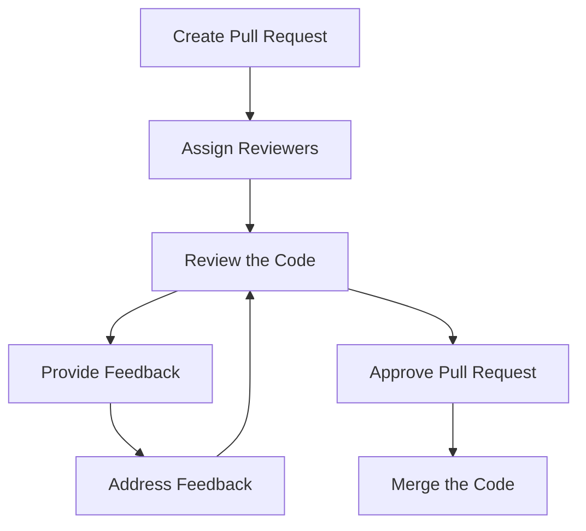

# Code Reviews

Code reviews are a critical part of the development process. They help ensure that the code is of high quality, maintainable, and that it follows the coding standards. They also provide an opportunity for team members to learn from each other.

## Process

1. **Create a Pull Request** - When you are ready to have your code reviewed, create a pull request. Make sure to include a description of the changes and any relevant information that the reviewer should know.
2. **Assign Reviewers** - Assign at least one reviewer to the pull request. This person should be someone who is familiar with the codebase and can provide valuable feedback.
3. **Review the Code** - The reviewer should carefully review the code, looking for any issues or areas for improvement. They should also check that the code follows the coding standards and best practices.
4. **Provide Feedback** - The reviewer should provide constructive feedback on the code. This could include suggestions for improvement, questions about the code, or pointing out potential issues.
5. **Address Feedback** - The author of the code should address the feedback provided by the reviewer. This may involve making changes to the code, answering questions, or explaining the reasoning behind certain decisions.
6. **Approve the Pull Request** - Once the reviewer is satisfied with the code, they can approve the pull request. At this point, the code can be merged into the main branch.
7. **Merge the Code** - Once the pull request has been approved, the author can merge the code into the main branch.

Check the Mermaid diagram below for a visual representation of the code review process:

## Best Practices

- **Be Respectful** - Remember that code reviews are about improving the code, not criticizing the author. Be respectful and constructive in your feedback.
- **Be Specific** - When providing feedback, be specific about what you think needs to be changed or improved. Vague comments like "this doesn't look right" are not helpful.
- **Focus on the Code** - Keep the discussion focused on the code itself, not the author. Avoid personal attacks or making assumptions about the author's intentions.
- **Ask Questions** - If you are unsure about something in the code, don't be afraid to ask questions. It's better to clarify things now than to have issues later.
- **Be Open to Feedback** - Remember that code reviews are a two-way street. Be open to receiving feedback on your code and be willing to make changes based on that feedback.
- **Learn from Each Other** - Code reviews are a great opportunity to learn from your peers. Take the time to understand the feedback you receive and use it to improve your coding skills.
- **Follow Up** - After the code has been merged, take the time to follow up on any feedback that was provided. This will help ensure that the codebase remains clean and maintainable.
- **Automate Where Possible** - Consider using automated tools to help with code reviews, such as linters, static analysis tools, and code formatting tools. These can help catch common issues and free up reviewers to focus on more complex problems.
- **Review Regularly** - Make code reviews a regular part of your development process. This will help catch issues early and ensure that the codebase remains consistent and maintainable.

## Resources

- [Code Review Best Practices](https://www.kevinlondon.com/2015/05/05/code-review-best-practices.html)
- [Code Review Guidelines](https://www.michaelagreiler.com/code-review-guidelines/)
- [Code Review Etiquette](https://mtlynch.io/human-code-reviews-1/)
- [Code Review Checklist](https://www.evoketechnologies.com/blog/code-review-checklist-best-practices/)
- [Code Review Tools](https://www.codereviewtools.com/)
